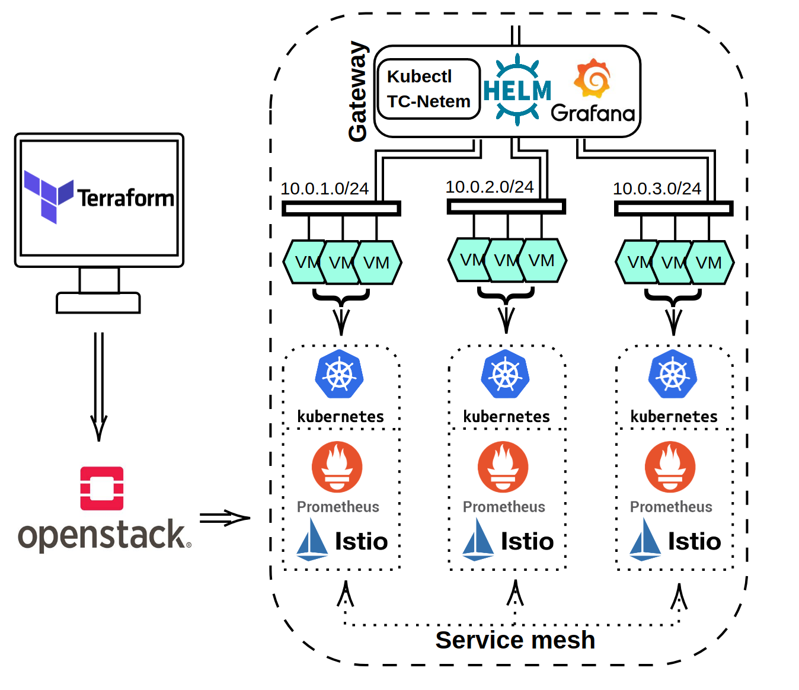

# FedApp

a research sandbox for application orchestration in federated clouds using OpenStack.

	

This collection of tools and scripts simplifies the setup of a virtualized multi-cluster infrastructure on OpenStack, complete with a fully functional software stack for orchestrating and monitoring multi-cloud applications. The setup itself is heavily scripted and require little user input apart from some initial settings regarding the virtualized infrastructure. The complete sandbox is illustrated in the figure above, and uses 

- **Terrafom/OpenStack** to create the virtualized infrastructure,
- **Kubernetes/Istio** to enable simplified multi-cluster application deployments and orchestration,
- **Promethus/Grafana** to perform federation-wide monitoring.

Each cluster in OpenStack is represented by a collection of virtual machines on a virtual local network, that connect to one another via a gateway. On this gateway, control and monitoring of all cluster software is gathered, and it is possible add custom network characteristics on cluster-to-cluster connections in order to mimic real world scenarios. 

We hope that this sandbox can be of use in reducing the effort needed to setup multi-cluster environments for application orchestration research under a wide variety of different scenarios. For a more thorough description, we refer to this [arXiv paper](https://arxiv.org/abs/2109.01480).

#### Setup

Access to an OpenStack cloud is assumed. Visit the sub folders and run the necessary scripts as described in the local READMEs in the following order

* Deploy the gateway virtual machine from your local computer in the `run_on_local/` folder.
* Deploy the virtualized clusters, Kubernetes, Istio and the federation-wide monitoring from the Gateway VM in the `run_on_gateway/` folder. 
* Deploy the example application and run the experiments from the Gateway VM in the `application/` folder

#### License & citing

The sandbox is free to use under the MIT license, but if used in a published work please cite the aforementioned paper.
